# NFLDrafter - Fantasy Football Open Scorer

A local-first fantasy football draft assistant with custom scoring profiles, player analysis, and a browser-persistent manual draft console. Built with FastAPI, React, and SQLite.

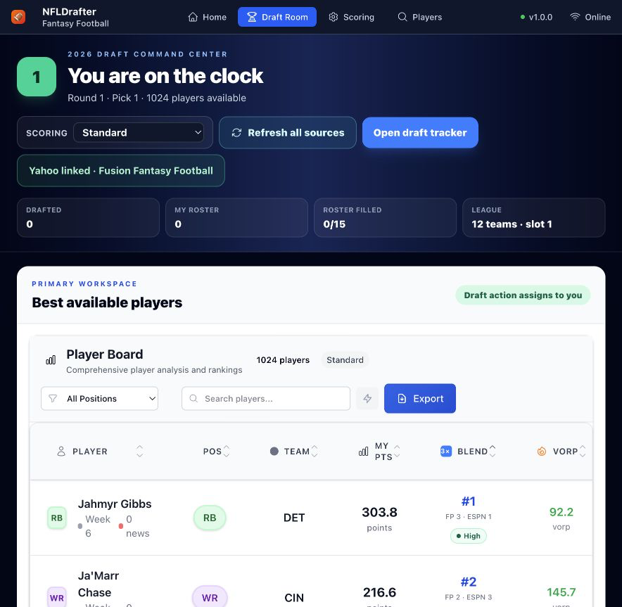

## Revival status (August 2026)

| Area | Status |
| --- | --- |
| Manual snake draft, undo/correction, persistence, CSV export | Implemented |
| Current/next-pick calculation and roster-aware recommendations | Implemented; recommendation weights are an initial baseline |
| Draft confidence and next-pick availability | Implemented from source agreement, FantasyPros expert ranges, and FFC ADP variance; availability remains a directional model |
| Custom scoring, player board, watchlist, and shared player detail | Implemented |
| Profile-scored FantasyPros/ESPN projections, position tiers, and VORP | Implemented with a persistent seven-day API cache, league/roster-aware replacement baselines, and labeled provider fallback |
| `nflreadpy` data-provider boundary | Implemented; live 2026 import requires network access |
| Yahoo OAuth token exchange | Implemented and live-verified with automatic token refresh and a non-secret server-readiness check |
| Yahoo read-only league snapshot | Implemented and live-verified for metadata, settings, teams, standings, rosters, draft results, transactions, scoreboard, available players, ownership, draft analysis, and season stats |
| Yahoo scoring-profile persistence and season-aware player-ID matching | Implemented, fixture-tested, and exercised against a credentialed 2026 league |
| Automated Yahoo live-pick synchronization | Not implemented; manual mode remains the reliable draft path |
| Versioned offline draft packages | Implemented with browser cache, JSON import/export, and checksum validation |
| FantasyPros ECR, ESPN draft rank, and FFC ADP | Implemented with daily timestamped snapshots, canonical-ID coverage, source attribution, a weighted draft rank, and player-level movement history |
| Service worker / installable PWA shell | Not implemented |

Yahoo is optional: after player data has loaded, the draft room prepares and caches a checksummed package containing the player board, scoring rules, league configuration, and roster slots. The board can reload that package without the backend, and packages can be moved between browsers as JSON.

## Features

- **Custom Scoring Profiles**: Create and test custom fantasy football scoring rules
- **Player Explorer**: Browse players, view stats, and compare scoring systems
- **Flexible Scoring Engine**: Support for multipliers, bonuses, thresholds, and caps
- **Local-First Design**: SQLite database with WAL mode for performance
- **Modern UI**: React frontend with Tailwind CSS and responsive design
- **API-First Architecture**: FastAPI backend with automatic documentation
- **Multi-Source Draft Rank**: FantasyPros expert consensus, ESPN platform rank, and human mock-draft ADP remain visible as separate inputs
- **Rich Player Profiles**: Last-season production, snap/target/rushing shares, expected-opportunity results, ESPN season/weekly projections, projection-derived team role, ownership context, modeled schedule strength, official injury reports, and player-linked news
- **Projection Analytics**: Score cached FantasyPros projected stat lines through the selected profile with ESPN fallback, derive position tiers and VORP from league settings, and feed those values into draft recommendations
- **Draft Confidence**: Explain source agreement and expert ranges, then estimate whether a player is likely to survive until the next user pick from FFC ADP variance
- **ADP Round Estimates**: Convert overall ADP into a likely round and pick within the round using the active league size
- **Ranking Movement**: Compare dated FantasyPros, ESPN, and FFC snapshots in every player profile, with feed freshness and missing matches called out explicitly
- **Yahoo Import Verification**: Preview teams, roster slots, draft rounds, and mapped scoring rules before import, then report player-ID coverage and unresolved matches
- **Read-Only Yahoo Cache**: Persist useful league, market, transaction, matchup, and completed-season player data so ordinary frontend views remain database-only

The current fantasy-relevant player pool contains 1,024 selectable players, including all 32 defenses. The August 2026 browser QA covered missing-player searches, position filters, board ordering, ADP round estimates, credentialed Yahoo reads, and player details opened from both the Draft Room and Player Explorer. See the [QA evidence](docs/QA.md) for the scenarios and captured screenshots.

## Ranking sources

NFLDrafter assigns each feed a specific role instead of treating every number as interchangeable:

| Source | Signal | Used for |
| --- | --- | --- |
| [FantasyPros ECR](https://www.fantasypros.com/nfl/rankings/consensus-cheatsheets.php) via `nflreadpy` | Expert consensus | Expert conviction, uncertainty range, and 50% of the initial blended draft rank |
| [FantasyPros API](https://www.fantasypros.com/api-data/) | Consensus projected stat lines | Cache-first preseason projections, custom-profile scoring, and team-relative opportunity shares |
| [ESPN Fantasy](https://www.espn.com/fantasy/football/) public player endpoint | Platform draft rank | Draft-room ordering and 20% of the initial blend |
| [Fantasy Football Calculator ADP](https://fantasyfootballcalculator.com/adp/ppr) REST API | Human mock-draft ADP | Expected acquisition cost, likely league-aware round, next-pick urgency, and 30% of the initial blend |
| [Yahoo Fantasy Sports](https://developer.yahoo.com/fantasysports/guide/) | Linked league and platform market context | Read-only league configuration, standings, rosters, transactions, matchups, ownership, draft analysis, and completed-season statistics |

The weights are an explainable starting baseline, not an accuracy claim. Missing sources are reweighted automatically. `GET /rankings/sources` reports snapshot dates and canonical-player match coverage, while `GET /rankings/?source=...` returns a specific feed. Fantasy Football Calculator permits API use and requests attribution; the product UI and this README provide it.


Manual mode is designed as the dependable fallback when a platform connection is unavailable. The tracker follows the configured snake order, changes the board action between `Mine` and `Taken`, removes recorded players from the available pool, keeps a searchable correction ledger, and persists the session in the browser.

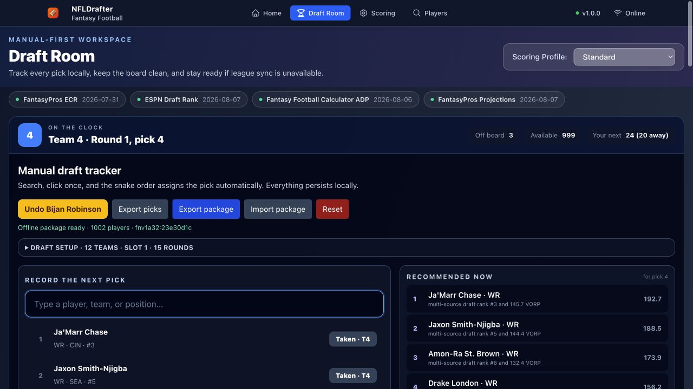

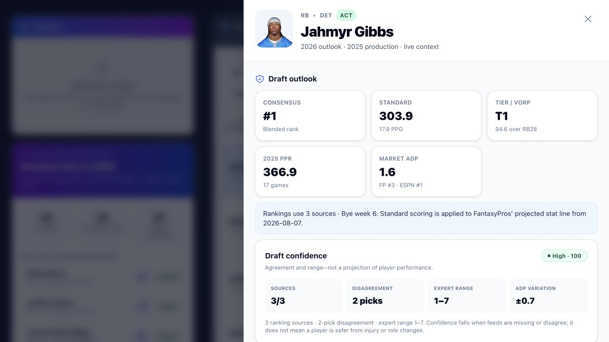

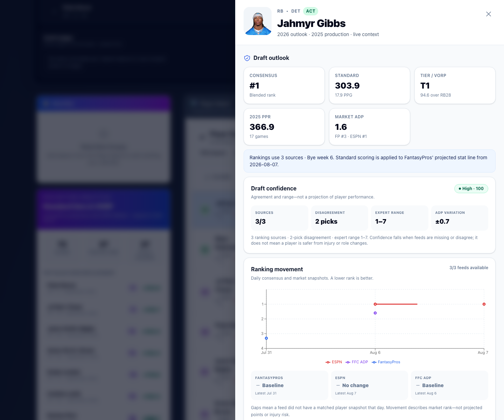

## Tech Stack

### Backend
- **FastAPI** + Pydantic v2 for API development
- **SQLAlchemy 2.x** with async support and aiosqlite
- **SQLite** with WAL mode and FTS5 for full-text search
- **nflreadpy** + Polars for NFL player data, statistics, rankings, and identifiers
- **Typer CLI** for ETL operations and administration

### Frontend
- **React 19** with TypeScript
- **Vite** for fast development and building
- **TanStack Query** for server state management
- **Tailwind CSS** for styling
- **Recharts** for data visualization

## Quick Start

### Prerequisites
- Python 3.9+
- Node.js 22.12+
- npm or yarn

### One-command setup

```bash
make bootstrap
make check
make dev
```

This creates `.venv`, installs locked frontend dependencies, initializes SQLite with default scoring profiles, runs the release-gate tests, and builds the frontend. The app is then available at `http://localhost:5173`; the API and its docs run at `http://localhost:8000` and `http://localhost:8000/docs`.

### Manual backend setup

1. **Clone and navigate to the project**
   ```bash
   cd NFLDrafter
   ```

2. **Create virtual environment and install dependencies**
   ```bash
   # Using uv (recommended)
   uv venv
   source .venv/bin/activate  # On Windows: .venv\Scripts\activate
   uv pip install -e .
   
   # Or using pip
   python -m venv .venv
   source .venv/bin/activate  # On Windows: .venv\Scripts\activate
   pip install -e .
   ```

3. **Set up environment variables**
   ```bash
   cp env.example .env
   # Edit .env with your configuration
   ```

   For official FantasyPros projections, set `FANTASYPROS_API_KEY` in `.env`.
   NFLDrafter caches each endpoint/query response in SQLite for seven days and
   serves stale cached data if the provider or daily quota is unavailable.
   The weekly projection importer makes at most six calls (one per position),
   while UI and API reads are cache-only. Use `--force` only when intentionally
   spending another six calls.

4. **Initialize the database**
   ```bash
   cd api
   python cli.py init
   ```

5. **Seed with sample data (optional)**
   ```bash
   # Seed current players and stats through nflreadpy
   python cli.py seed-players
   python cli.py load-stats 2024,2025,2026
   ```

6. **Start the API server**
   ```bash
   uvicorn app.main:app --reload --port 8000
   ```

### Frontend Setup

1. **Navigate to frontend directory**
   ```bash
   cd frontend
   ```

2. **Install dependencies**
   ```bash
   npm install
   ```

3. **Start development server**
   ```bash
   npm run dev
   ```

4. **Open in browser**
   Navigate to `http://localhost:5173`

## Usage

### Scoring Profile Builder

1. Navigate to the Scoring Builder page
2. Create custom scoring rules with:
   - **Multipliers**: Points per unit (e.g., 0.1 points per yard)
   - **Bonuses**: Extra points for reaching thresholds
   - **Caps**: Maximum points per category
3. Test your profile with sample data
4. Save profiles for later use

### Player Explorer

1. Navigate to the Player Explorer page
2. Select a season, position, and scoring profile
3. Search the complete fantasy-relevant player pool or sort its source-aware board
4. Select any player to open last-season production, advanced usage, cached FantasyPros projections with ESPN fallback, schedule strength, injury reports, and linked news
5. Open the same detail view from the Draft Room while making picks

### API Endpoints

- **GET** `/fantasy/points` - Calculate fantasy points
- **GET** `/players/{id}/stats` - Get weekly player statistics
- **GET** `/players/{id}/summary` - Get last-season totals and advanced usage
- **GET** `/players/{id}/context` - Get cached projection, schedule strength, injury, and news context
- **GET** `/fantasy/profiles` - List scoring profiles
- **GET** `/rankings/sources` - List ranking feeds, freshness, and player-ID coverage
- **GET** `/rankings/?source=fantasypros-ecr` - Query a specific ranking snapshot
- **GET** `/rankings/{player_id}/history` - Get source-rank movement for one player
- **GET** `/rankings/projection-analytics` - Score projections and derive tiers/VORP for a profile and league configuration
- **GET** `/rankings/fantasypros/cache-status` - Inspect cache freshness and locally tracked daily-call usage without exposing the key
- **GET** `/yahoo/readiness` - Confirm OAuth credentials and callback configuration without exposing secrets
- **GET** `/yahoo/leagues/{league_id}/snapshot` - Read the persisted frontend-ready Yahoo league snapshot without contacting Yahoo
- **POST** `/yahoo/leagues/{league_id}/sync` - Refresh the linked league's supported read-only Yahoo resources and persist one snapshot
- **GET** `/news/players/{player_id}/features` - Get player-linked news features and headlines
- **GET** `/health` - Health check

API documentation available at `http://localhost:8000/docs`

## CLI Commands

```bash
# Initialize database and seed default profiles
python cli.py init

# Seed players from nflreadpy
python cli.py seed-players

# Load weekly stats for specific seasons
python cli.py load-stats 2024,2025,2026

# Add nflverse snap share and expected-opportunity history
python cli.py load-usage 2025

# Refresh FantasyPros, ESPN, and FFC draft snapshots
python cli.py load-draft-sources --season 2026 --scoring PPR --teams 12

# Import official FantasyPros projection samples (six cache-first position reads)
python cli.py load-fantasypros-projections --season 2026

# Load official weekly injury reports and ESPN NFL news
python cli.py load-injuries 2025
python cli.py load-news --limit 50

# View all available commands
python cli.py --help
```

## Project Structure

```
NFLDrafter/
├── api/                          # FastAPI backend
│   ├── app/
│   │   ├── models.py            # SQLAlchemy models
│   │   ├── schemas.py           # Pydantic schemas
│   │   ├── scoring.py           # Scoring engine
│   │   ├── db.py                # Database configuration
│   │   ├── main.py              # FastAPI application
│   │   ├── routers/             # API route handlers
│   │   └── services/            # Business logic
│   └── cli.py                   # CLI commands
├── frontend/                     # React frontend
│   ├── src/
│   │   ├── components/          # React components
│   │   ├── hooks/               # Custom React hooks
│   │   └── api.ts               # API client
│   └── package.json
├── .cursorrules                  # Development guidelines
├── pyproject.toml               # Python project config
└── README.md
```

## Development

### Code Quality

- **Python**: Use `ruff` for linting, `black` for formatting
- **TypeScript**: ESLint and Prettier for code quality
- **Database**: Follow SQLAlchemy best practices

### Testing and release gate

```bash
make check
```

The release gate runs backend tests, the maintained frontend suite, Python bytecode compilation, and a production frontend build. A set of pre-revival frontend suites is explicitly quarantined in `frontend/vite.config.ts` because those files target removed hooks/markup or contain non-dispatching IndexedDB mocks; the active draft engine and console have focused coverage.

### Database Migrations

The project uses SQLAlchemy with automatic table creation. For production deployments, consider using Alembic for migrations.

## Configuration

### Environment Variables

- `DATABASE_URL`: Database connection string
- `YAHOO_CLIENT_ID`: Yahoo OAuth client ID
- `YAHOO_CLIENT_SECRET`: Yahoo OAuth client secret
- `YAHOO_REDIRECT_URI`: Exact HTTPS callback registered in Yahoo; for local development, point an HTTPS tunnel at port 8000 and append `/auth/yahoo/callback`
- `YAHOO_FRONTEND_CALLBACK_URI`: Browser handoff after Yahoo returns; locally use `http://localhost:5173/auth/callback`
- `DEBUG`: Enable debug mode
- `ALLOWED_ORIGINS`: CORS allowed origins
- `NFL_SEASON`: Upcoming draft season (default `2026`)
- `STATS_BASELINE_SEASON`: Completed season persisted for player production and usage (default `NFL_SEASON - 1`)
- `DRAFT_SCORING`: Scoring format requested by the manual ESPN/FFC refresh (default `PPR`)
- `DRAFT_LEAGUE_SIZE`: League size requested by the manual FFC refresh (default `12`)
- `NEWS_REFRESH_LIMIT`: ESPN articles cached during Refresh all sources (default `20`)
- `ENABLE_BACKGROUND_REFRESH`: Opt into scheduled website refreshes (default `false`). Leave disabled for the local-first, manual-refresh contract.
- `DRAFT_SOURCES_SCHEDULE_CRON`: Draft-source schedule used only when `ENABLE_BACKGROUND_REFRESH=true`
- `YAHOO_AVAILABLE_PLAYER_LIMIT`: Maximum available Yahoo players cached per linked league (default `300`, capped at `300`)
- `YAHOO_PLAYER_STATS_LIMIT`: Maximum Yahoo players included in completed-season stat batches (default `300`, capped at `500`)

The redirect URI is an exact-match HTTPS setting in Yahoo. In the Yahoo developer application, register the same value used by `YAHOO_REDIRECT_URI`—including scheme, host, port, path, and trailing-slash choice. For local development, `cloudflared tunnel --url http://localhost:8000` provides a temporary HTTPS host; append `/auth/yahoo/callback` and use that complete value in both Yahoo and `.env`. NFLDrafter then relays the result to the local frontend callback. An OAuth page reporting `invalid redirect uri` means these values differ.

### Database Configuration

- **SQLite**: Default with WAL mode for performance
- **Postgres**: Change `DATABASE_URL` to postgresql://...
- **FTS5**: Full-text search for news content

## Data notes

- ESPN's native projected fantasy points remain available for comparison. NFLDrafter also scores the projected box-score fields through the selected profile; when no profile rule matches an available kicker or defense projection, the response labels its ESPN PPR fallback.
- VORP uses the selected league size and starter counts. FLEX is allocated evenly across RB, WR, and TE; SUPERFLEX is allocated to QB. The API returns the exact replacement ranks and tier thresholds used.
- Schedule strength is modeled from the previous season's PPR points allowed by position. Its 160 team/position results are persisted during Refresh all sources, so player-detail reads do not contact nflverse. Rank 1 means the easiest modeled schedule; it is context, not a forecast.
- Injury data comes from weekly official injury-report data available through `nflreadpy`; news is fetched from ESPN's public NFL news endpoint and linked to players by relevance scoring.
- Historical opportunity combines Pro Football Reference snap counts distributed by nflverse with nflverse play-level expected fantasy points and rushing opportunity. Route participation and official current depth rank are left unavailable when the summarized source cannot support them directly.
- Draft-source rows retain their snapshot date and attribution. Missing sources are reweighted instead of silently treated as zero.
- External data is database-first and does not refresh in the background by default. Refresh all sources persists the player directory, completed-season weekly stats and usage, schedule context, Sleeper IDs, ESPN news, rankings, projections, and injuries; provider failures remain isolated. Player profiles chart the history returned by `GET /rankings/{player_id}/history`.
- The same Refresh all sources action independently refreshes the selected Yahoo league. A successful snapshot stores every supported read-only response needed by the UI; ordinary league views never spend Yahoo calls. Yahoo does not expose a dedicated projections resource in the documented Fantasy Sports API, so FantasyPros and ESPN remain the projection providers.
- Draft confidence measures ranking evidence, not player safety. Next-pick availability is a directional normal-distribution model using FFC standard deviation when available and a labeled estimated spread otherwise.

## Performance

- Scoring calculations: <50ms per profile
- Database queries: Optimized with proper indexing
- Frontend: Bounded, internally scrolling player board for large datasets
- News search: FTS5 for fast text queries

## Next roadmap milestones

- [x] Persist imported Yahoo settings as an internal scoring profile, with unknown categories reported instead of guessed
- [x] Add durable, season-aware external player-ID mappings with match confidence and ambiguity reporting
- [x] Generate a versioned offline draft package with checksum validation and browser recovery
- [x] Add a complete fantasy-relevant player universe and shared detail from both draft surfaces
- [x] Add 2025 production, ESPN projections, schedule strength, injuries, and player-linked news
- [x] Score projected box stats through the selected profile, then activate transparent tiers and VORP
- [x] Schedule isolated daily draft-source snapshots and chart player-level ranking movement
- [x] Add historical snap share, target/rushing share, and expected-opportunity context without inventing route or depth-chart proxies
- [x] Complete a credentialed Yahoo league-import and read-only snapshot dress rehearsal
- [ ] Add Playwright coverage for refresh, undo, correction, and export
- [ ] Add rank-confidence, ADP-urgency, and expected-availability calibration

The prioritized implementation sequence and product guardrails are maintained in [roadmap.md](roadmap.md).

## Screenshots and project page

The checked-in QA captures are reusable in issues, release notes, and project documentation:

| Live player explorer | Player analytics |
| --- | --- |
|  | 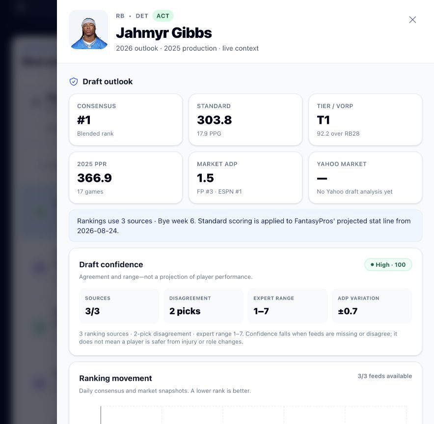 |

| Schedule, injuries, and news | Scoring builder |
| --- | --- |
| 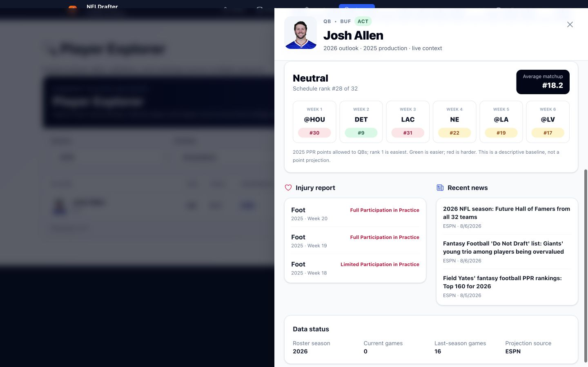 | 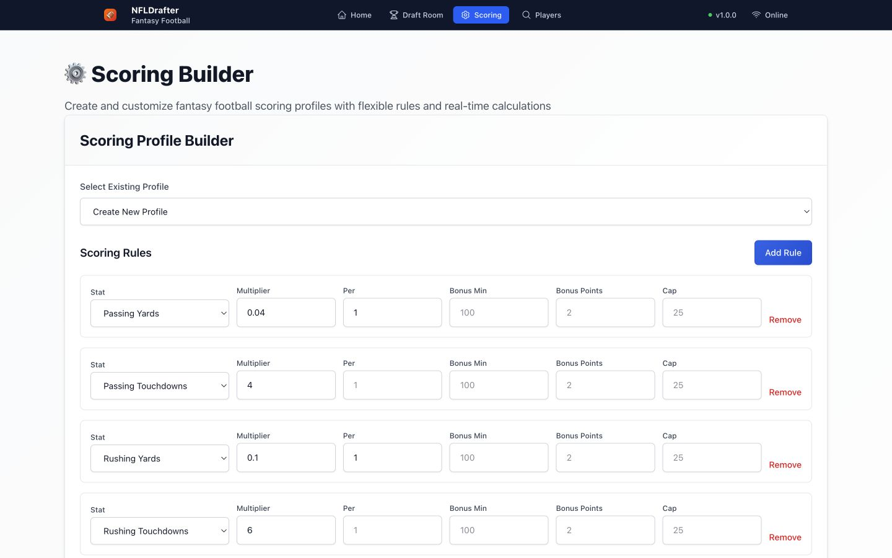 |

| Profile-scored detail | League-aware tiers and VORP |
| --- | --- |
| 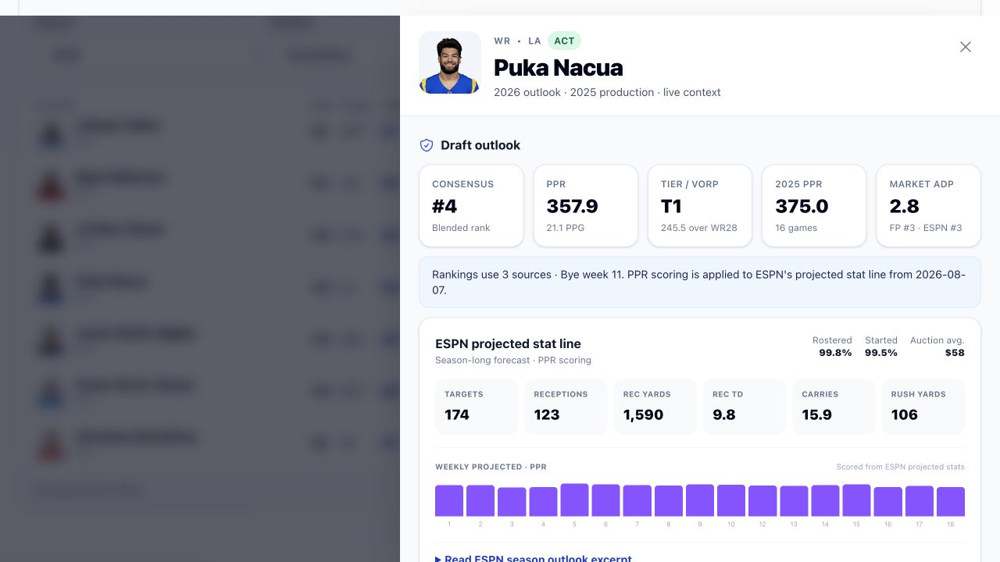 | 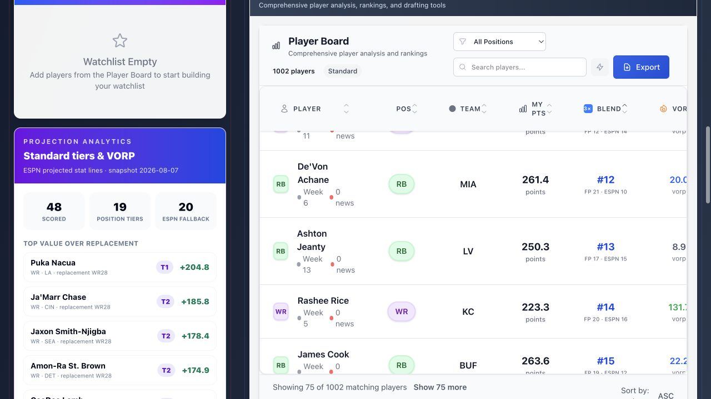 |

| Projection-derived team role |
| --- |
| 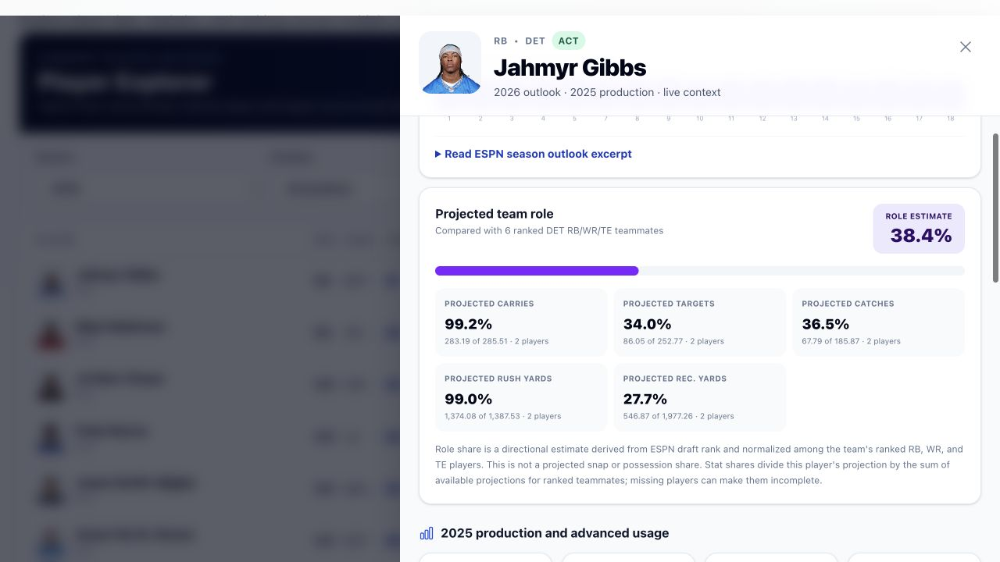 |

| Cached FantasyPros projections |
| --- |
| 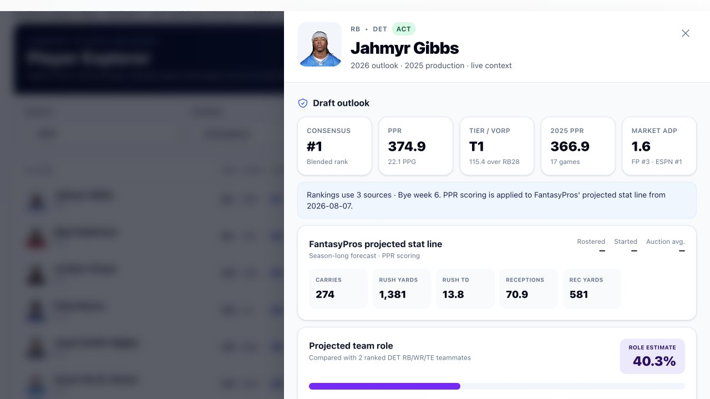 |

| Yahoo OAuth readiness |
| --- |
| 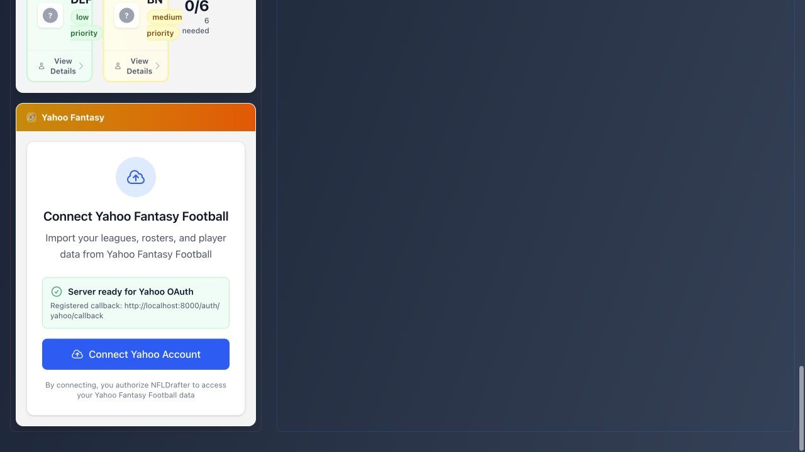 |

| Daily ranking movement |
| --- |
|  |

| Historical opportunity |
| --- |
| 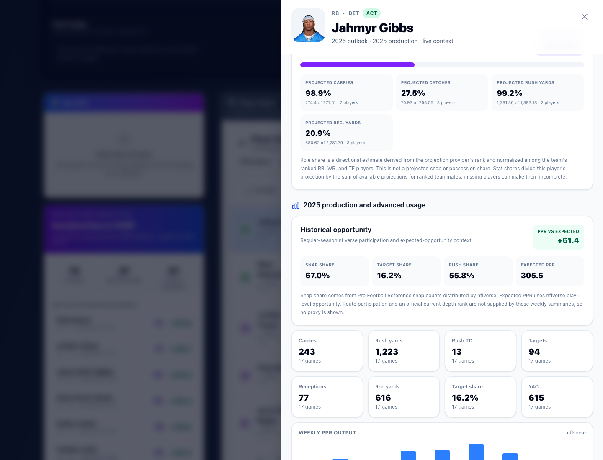 |

`docs/index.html` is a dependency-free product page. The `GitHub Pages` workflow publishes that directory after Pages is configured to use **GitHub Actions** in the repository settings.

## Contributing

1. Fork the repository
2. Create a feature branch
3. Follow the coding standards in `.cursorrules`
4. Add tests for new functionality
5. Submit a pull request

## License

This project is licensed under the MIT License - see the LICENSE file for details.

## Support

For questions and support:
- Create an issue on GitHub
- Check the API documentation at `/docs`
- Review the `.cursorrules` file for development guidelines
